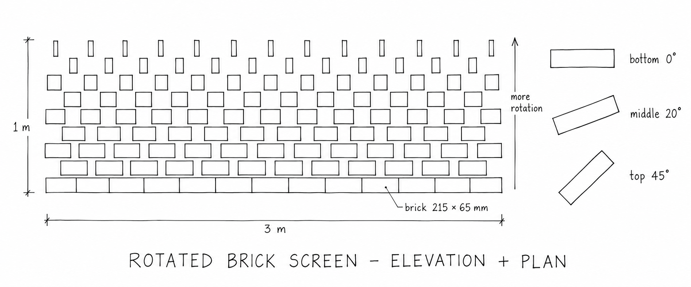

# Technique 2: Prompt + Image → Script → Debug

> **In one line:** give the AI agent a **sketch** as well as a prompt, ask for a Grasshopper Python script, then debug it, including comparing the result **with the sketch**.

---

## The loop

```
   ┌──────────────┐      ┌──────────┐      ┌──────────────┐
   │ PROMPT +     │ ───► │  SCRIPT  │ ───► │    DEBUG     │
   │ IMAGE        │      │ paste +  │      │ errors? does │
   │ sketch + text│      │  wire up │      │ it match the │
   └──────────────┘      └──────────┘      │ sketch?      │
          ▲                                └──────┬───────┘
          └──────────────── repeat ───────────────┘
```

**What's new compared with Technique 1:**

- A sketch shows the **shape and the rule** much faster than words. A sketch **doesn't** reliably show the **numbers**, so your text still has to give them.
- Debugging now has two kinds of problem: **errors** (the component turns red) and **mismatches** (it runs, but the result doesn't look like the sketch). For mismatches you send the agent a **screenshot** next to the sketch.

---

## The task

Build a **rotated brick screen**: a wall of bricks in stretcher bond, where each course rotates its bricks a little more than the course below, opening gaps for light and air.



---

## Step 1: Make the sketch

Draw it by hand and photograph it, or generate it with an image AI. This is the prompt used for `Sketch.png`:

```text
Create a hand-drawn architectural sketch of a rotated brick screen wall, as if drawn
with a black fine-liner pen on white paper.

MAIN DRAWING: a flat, straight-on front ELEVATION of the wall.
- The wall is 12 bricks wide and 10 courses (rows) high, in stretcher bond:
  each course is shifted by half a brick compared to the one below.
- Every brick is the same size and sits on its own point in a regular grid.
- The bottom course is laid flat and solid, with no gaps.
- Moving up the wall, each course rotates its bricks a little more about their
  own vertical axis, so the bricks look gradually narrower from the front and
  small gaps of light appear between them.
- The top course is rotated about 45°, with the widest gaps.
- All bricks in the same course are rotated by the same amount.

SMALL PLAN DETAIL (to the right of the elevation, drawn smaller):
- A top view of three single bricks, stacked vertically and labelled
  "bottom 0°", "middle 20°" and "top 45°", showing how far each one is rotated.

Annotations (neat handwritten architect's lettering, few and clearly legible):
- A horizontal dimension line under the wall labelled "3 m".
- A vertical dimension line beside the wall labelled "1 m".
- A small label pointing to one brick: "brick 215 × 65 mm".
- A vertical arrow beside the wall, pointing up, labelled "more rotation".
- A title below: "ROTATED BRICK SCREEN – ELEVATION + PLAN".

Style: hand-drawn architectural sketch, black fine-liner on white paper, flat 2D
views only, no perspective, no shading, no colour, no people, no background.
Clean and simple, with bricks that are easy to count.
```

### Read your sketch before you send it

Look closely at `Sketch.png`. It **does not quite match** the prompt that made it, and parts of it **contradict each other**:

| What the sketch shows | The problem | Your decision |
|-----------------------|-------------|---------------|
| **9** courses; **13** bricks, then 12, alternating | The prompt asked for 10 courses and 12 bricks | Count the sketch and use what's drawn: 9 and 13 |
| 13 bricks × 215 mm = 2.8 m, labelled **3 m** | The numbers don't add up | Spread the bricks evenly along 3 m, leaving small joints |
| 9 courses × 65 mm = 0.6 m, labelled **1 m** | Bricks can't touch top to bottom *and* make 1 m | Stack the courses with a 10 mm mortar joint (about 0.7 m tall) and ignore the 1 m label |
| Top bricks look **tall and narrow** | Turning a brick about a vertical axis makes it narrower from the front, **not taller** | Ignore the extra height: every brick is 65 mm high |
| Plan says top = **45°**, but the top course looks nearly edge-on | The elevation exaggerates the rotation | Trust the written number: 45° |

> **Lesson:** an image from an AI (or from you, drawn quickly) is a **diagram of an intention**, not a measured drawing. Write the numbers you want into your prompt. Otherwise the agent has to guess, and it will guess differently from you.

---

## Step 2: Prompt + image

Attach `Sketch.png` to your AI agent (Claude, ChatGPT, Copilot, Gemini…) and send this prompt with it:

```text
The attached image is a hand-drawn sketch of a rotated brick screen wall:
a front elevation on the left and a small plan detail on the right.

Write a Python script for the Grasshopper "Python 3 Script" component in Rhino 8
that builds this wall in 3D.

Read these from the sketch:
- Stretcher bond: every other course is shifted by half a brick.
- The bottom course is not rotated. Each course above is rotated a little more,
  up to the top course. The plan detail shows the rotation: 0° bottom, 45° top.
- Each brick turns about its OWN vertical axis (like a door opening), not
  sideways, and not around the origin.

Use these numbers (the sketch is not to scale):
- Units are millimetres. The wall stands upright in the XZ plane:
  X along the wall, Z up, Y through the wall.
- Wall length 3000 mm, 9 courses stacked directly on top of each other
  with a 10 mm mortar joint between courses (ignore the "1 m" label).
- 13 bricks in the even courses and 12 in the shifted courses.
- Brick 215 mm long, 102.5 mm deep, 65 mm high.

Inputs I want as component parameters:
- wall_length (float)
- course_gap (float): the vertical joint between two courses
- bricks_per_course, courses (int)
- brick_length, brick_depth, brick_height (float)
- max_rotation (float): the top course's rotation in degrees

Outputs I want:
- bricks: the brick geometry
- centres: the centre point of each brick
- angles: the rotation of each brick in degrees

Rules:
- Python 3 only (start the script with #! python3). Not IronPython or GhPython.
- Use only Rhino.Geometry and the Python standard library (math). No rhinoscriptsyntax, no numpy.
- Return Rhino.Geometry objects, not GUIDs.
- Use simple, readable code with a short comment on every line. I am a beginner.

Before the code, give me a table of the component inputs with:
Name | Type hint | Access (Item or List) | What to connect (slider range and start value).
Then list the output names.
```

> **Try it without the numbers first.** Send only the image and the first two lines of the prompt. Compare what you get with the full prompt. That difference is what your text adds to the sketch.

---

## Step 3: Script

Set up the component exactly as in [Technique 1](../Technique%201/Prompt_Script_Debug.md#step-2-script): place a **Python 3 Script** component, paste the code, zoom in, use **⊕** to add inputs and outputs, then rename them and set their type hints.

**Set your Rhino file to millimetres** before you start (`Units` command).

| Name | Type hint | Access | Connect to |
|------|-----------|--------|------------|
| `wall_length` | float | Item | Number Slider, 1000 – 6000, start 3000 |
| `course_gap` | float | Item | Number Slider, 0 – 50, start 10 |
| `bricks_per_course` | int | Item | Number Slider, **integer**, 2 – 30, start 13 |
| `courses` | int | Item | Number Slider, **integer**, 2 – 20, start 9 |
| `brick_length` | float | Item | Number Slider, 100 – 400, start 215 |
| `brick_depth` | float | Item | Number Slider, 50 – 200, start 102.5 |
| `brick_height` | float | Item | Number Slider, 30 – 150, start 65 |
| `max_rotation` | float | Item | Number Slider, 0 – 90, start 45 (degrees) |

| Output | What comes out |
|--------|----------------|
| `out` | Printed summary. **Keep it and don't rename it.** |
| `bricks` | The rotated bricks (Breps) |
| `centres` | One point per brick |
| `angles` | One angle per brick, in degrees |

Look at the result in the **Front** viewport to compare it with the elevation, and in the **Top** viewport to compare it with the plan detail.

---

## Step 4: Debug

### 4a. Errors (red or orange component)

Send the exact error back exactly as in [Technique 1](../Technique%201/Prompt_Script_Debug.md#step-3-debug): the full message, your input names and type hints, what you expected and what you see. The error table there applies here too (`NameError`, `int` vs `float`, GUIDs, `numpy`…).

### 4b. Mismatches: it runs, but it doesn't look like the sketch

This is the new part. Take a screenshot of the **Front** viewport (and the **Top** viewport if the problem is the rotation). Then send it to the agent **with the original sketch**:

```text
Attached are my original sketch and two screenshots of what your script
produces in Rhino (Front view and Top view).

List every difference between the sketch and the result, most important
first. Then fix the script so it matches the sketch. Keep the same input
and output names. Only change what is needed.
```

Describe what's wrong in **drawing words**: elevation, plan, course, bond, rotate about a vertical axis. "It looks weird" gives the agent nothing to work with.

### Mismatches you are likely to see in this exercise

| What you see | Usual cause | Tell the agent |
|--------------|-------------|----------------|
| The wall lies **flat on the ground** | The agent read the elevation as a plan and built the wall in the XY plane | *"The sketch is an elevation. The wall must stand up: X along the wall, Z up."* |
| Bricks **tilt** sideways in the Front view | Rotation about the wrong axis (X or Y) | *"Rotate each brick about a vertical (Z) axis through its own centre."* |
| The whole wall **swings around** the origin | Rotation centred on (0,0,0), not on each brick | *"Rotate each brick around its own centre, not the origin."* |
| Every course has the **same** rotation | The angle isn't linked to the course number | *"Rotation should grow from 0° at the bottom course to max_rotation at the top."* |
| No **half-brick shift** between courses | The bond is missing | *"Use stretcher bond: shift every other course by half a brick and use one fewer brick."* |
| Shifted courses **stick out** past the wall's end | Shifted courses still have the full number of bricks | *"Shifted courses need one fewer brick so they stay inside the wall."* |
| Bricks are **tiny or huge** | Metres vs millimetres | *"Everything is in millimetres. My Rhino file is set to mm."* |
| Bricks **float** with big gaps between courses | The agent spread 9 courses over the "1 m" label | *"Stack the courses: each course sits one brick height plus a 10 mm joint above the one below."* |

The last row isn't a bug in the code. It's a **design decision the sketch hid**. Spotting that is the most valuable part of this exercise.

---

## Once it works

Try these follow-up prompts, one at a time, and repeat Script → Debug after each:

1. `Instead of rotating by course, rotate each brick based on its distance to an attractor point.`
2. `Make the rotation follow a wave along the wall instead of growing upwards.`
3. `Colour the bricks from light (0°) to dark (max rotation). Add a colours output.`
4. `Draw a new sketch` (by hand or with an image AI) `of your own variation, and send it with the current script: "Change this script so it matches my new sketch."`

---

## Check yourself

- [ ] I checked my sketch for contradictions **before** sending it, and wrote the real numbers in my prompt.
- [ ] My prompt said which view the sketch is (elevation, plan) and which way is up.
- [ ] When the result didn't match, I sent a **screenshot plus the sketch** and described the difference in drawing words.
- [ ] The Front view looks like the elevation and the Top view shows the rotation from the plan detail.
- [ ] I can point to the part of the code that is the Producer, the Operator and the Consumer.

---

## Tutor reference

A working version of this script is in [`Prompt_Image_Debug.py`](Prompt_Image_Debug.py) in this folder. Students should try the loop with their own agent first, then compare their result with it.
